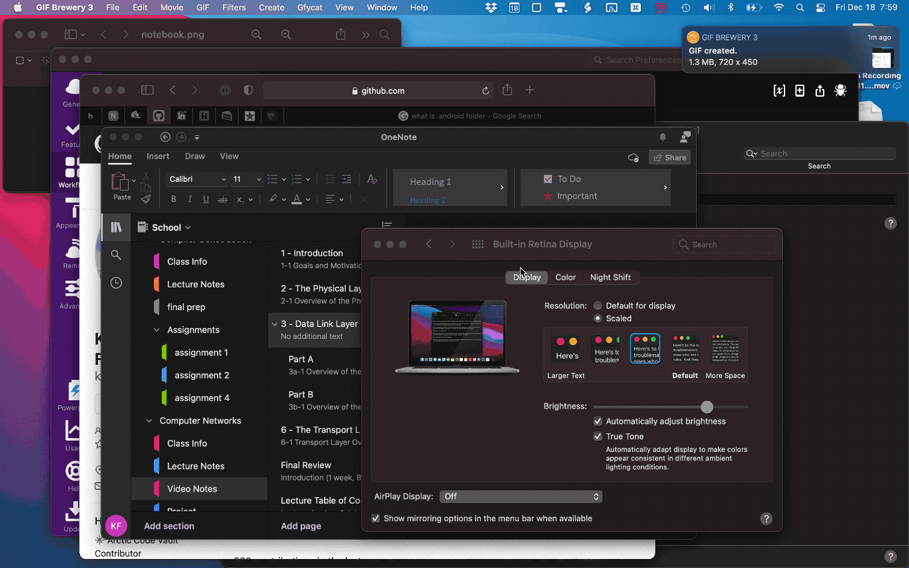

# Navigate OneNote Notebooks With Alfred

Browse and open your Microsoft OneNote notebooks from [Alfred 4][alfredapp].

<!-- MarkdownTOC autolink="true" bracket="round" depth="3" autoanchor="true" -->

- [Features](#features)
- [Installation](#installation)
- [Usage](#usage)
- [Configuration](#configuration)
- [Licensing & thanks](#licensing--thanks)
- [Changelog](#changelog)

<!-- /MarkdownTOC -->

## Features

- Browse all OneNote Notebooks and sections/section groups
- Press <kbd>↩︎</kbd> to continue diving deeper into notebook hierarchy. Once a page is found (deepest depth) it will open it in OneNote
- Press <kbd>⌘</kbd><kbd>↩︎</kbd> to open the currently selected notebook/section/section group

## Installation

Download [the latest release][gh-releases] and double-click the file to install in Alfred.

## Usage

The two main keywords are `;o` & `;sa`:

- `;o [<query>]` — Browse OneNote notebooks in Alfred.

    - <kbd>↩︎</kbd> or <kbd>⌘</kbd><kbd>NUM</kbd> — View the selections sub-sections, if it has no sub-sections (deepest level of notebook) it will open the page in OneNote.
    - <kbd>⌘</kbd><kbd>↩︎</kbd> — Open selection in OneNote instead.

- `;sa [<query>]` - Search all notebooks/section groups/sections

Base url is stored with `seturl`:

### Configuration

The workflow locates a plist file that contains the names of the notebooks, sections and pages, and then uses those to build a URL that OneNote can respond to. The base of the URL, however, is unique to each machine and cannot be found within the plist. So in order for this workflow to work
1. Open OneNote, right click a notebook, section, or page and click the `Copy Link to {Page/Notebook/Section}`.
2. Use the `seturl` keyword and paste the copied link and press <kbd>↩︎</kbd>. After the base url is stored, the workflow should be functional.
    - **_NOTE:_** If your notebook is stored on Microsoft Sharepoint, the URL that's created _cannot be opened locally_, the notebook must be stored in OneDrive for the URL to valid.
- View the gif below to see this in action.

## Licensing & thanks

This workflow is released under the [MIT Licence][mit].

This workflow uses on the wonderful library [alfred-workflow](https://github.com/deanishe/alfred-workflow) by [@deanishe](https://github.com/deanishe).

## Changelog

- v1.0.0 — 06/14/19
    - First public release
- v1.2.0 - 06/19/19
    - Fixed storage of base url
- v1.2.2 - 10/14/19
    - Added trap for sharepoint URLs

[alfredapp]: https://www.alfredapp.com/
[gh-releases]: https://github.com/kevin-funderburg/alfred-microsoft-onenote-navigator/releases/latest
[mit]: https://raw.githubusercontent.com/kevin-funderburg/alfred-microsoft-onenote-navigator/master/LICENCE.txt
